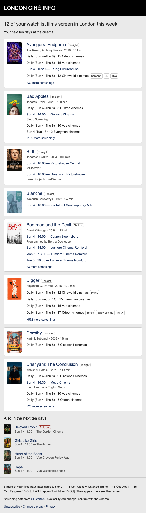
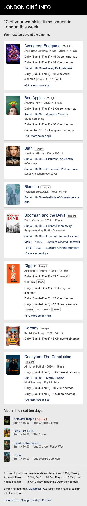

# Weekly digest sample

Rendered at 600px and 390px in Chromium using the live catalogue from 4 October
2026, at 14:29 London time. This is an arbitrary sample of catalogue films,
not an account's watchlist. No accounts are queried and no email is sent.
The unsubscribe token in generated samples is deliberately invalid.

The chosen direction B uses one card per film, eight cards maximum, followed by
compact entries for sold-out films and overflow. Chain venues collapse into a
summary; only consecutive screening dates receive the “Daily” label. Routine
standard/2D formats are omitted from badges. The window ends on the London date
ten days ahead, including that date; past screenings today are excluded.

Generate your own HTML and text sample after building catalogue data:

```sh
npx tsx scripts/preview-digest.ts .cache/digest-sample.html 2026-10-04T13:29:00Z
```

Email-client delivery/rendering still needs manual verification. These screenshots
verify the template's local layout only.

## Desktop — 600px



## Mobile — 390px


